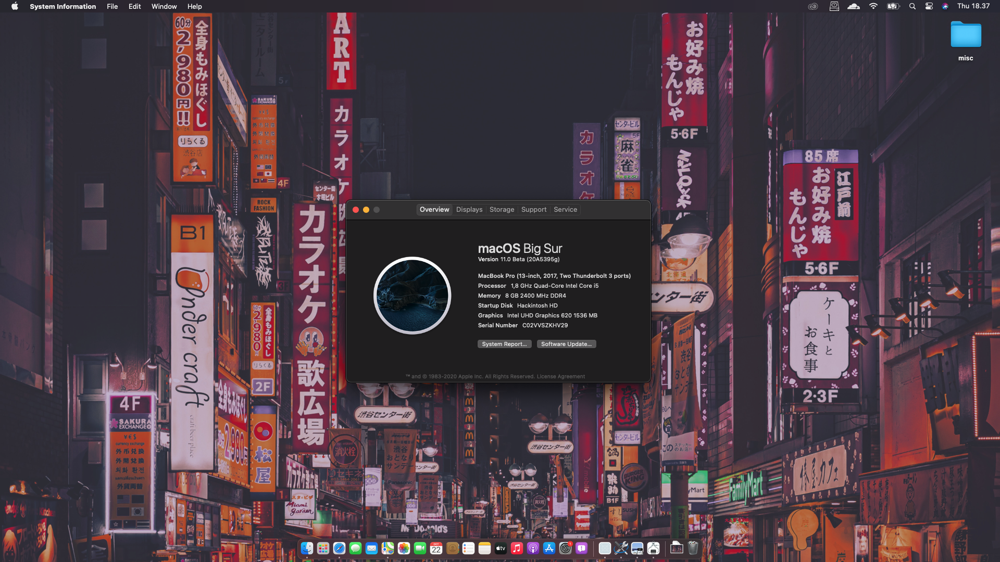
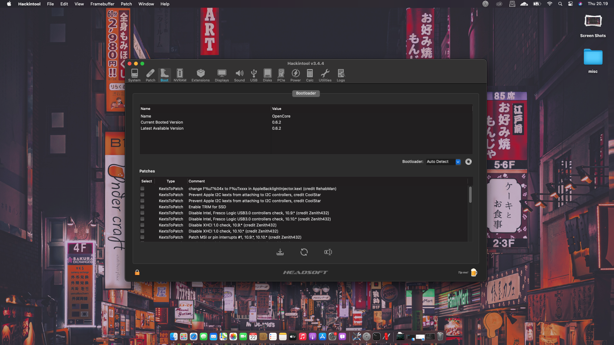
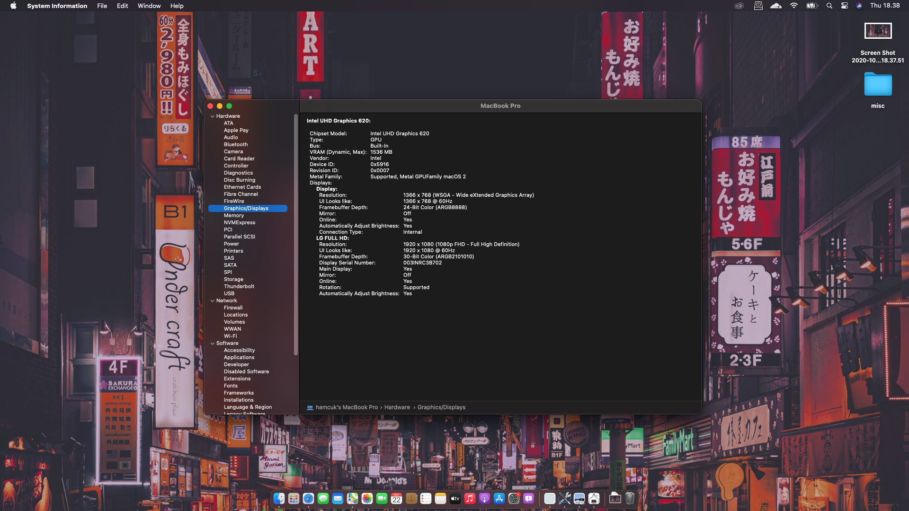
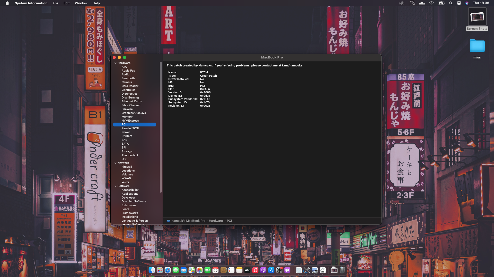
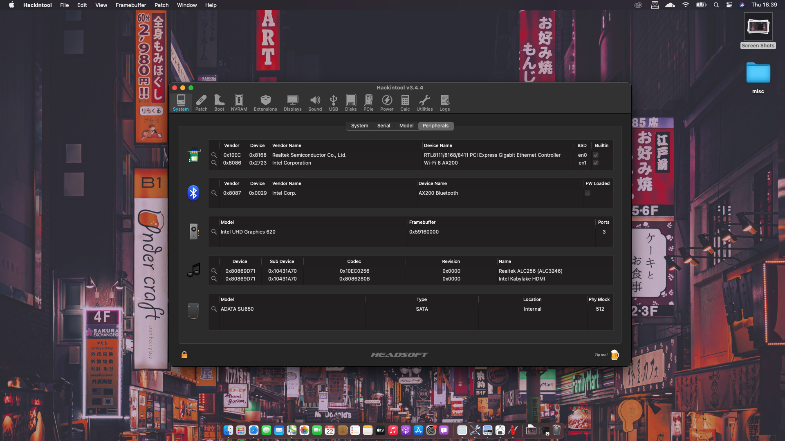
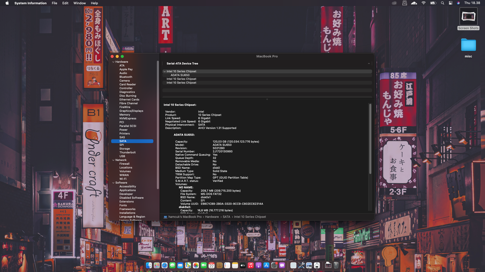
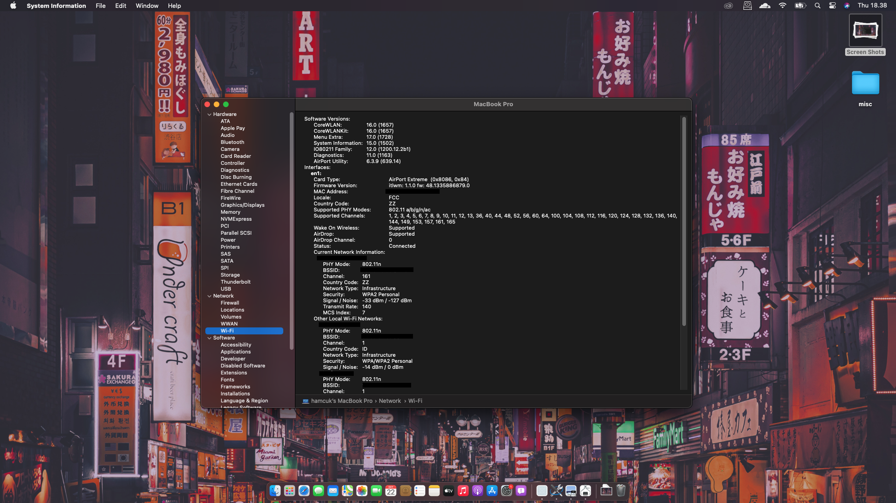

# ASUS X442UR/R Hackintosh
This is EFI Patch based on OpenCore bootloader that I've made. It's just for series X442UR, X442URR, A442UR, or A442URR, if you're facing a problem using this EFI, you can open issue in this repo or contact me on [Telegram](https://t.me/hamcuks)

## Technical Specs

Specifications | Detail
------------| ----------
Computer Model | ASUS X442URR
Processor   | Intel Core i5-8250U
iGPU        | Intel UHD 620 Graphics
dGPU        | Nvidia 930MX
Storage     | ADATA 120GB SSD SATA III
RAM         | 2 x 4GB
WLAN        | Qualcomm QCA9377
Ethernet    | RTL8111/8168H
Trackpad    | Elan 1200 I2C
Audio | Realtek ALC256 Audio Codec
BIOS Version | X442URR.308
 
## Bootloader
Bootloader        | Version
------------| ----------
OpenCore | 0.6.2
Clover | Ongoing

## BIOS Configuration
Please disable this configurations in BIOS. You can enable again after installation
- Vt-D
- Vt-X
- Disable Fastboot
- CSM 
- Secure Boot
- set DVMT-Prealloc to 64MB

## Supported macOS
| macOS | Version | OC | Clover
--------| --------| ---- | ------
Big Sur | 11.0.1 (20B29) | YES | Ongoing
Big Sur | Beta 10 | YES | Ongoing
Catalina | 10.15.7 | YES | Ongoing
Mojave | 10.14.6 (18G95) | YES | Ongoing
High Sierra | 10.13.6 | YES | Ongoing

## Whats working?
- Multiboot, this patch suitable for multibooting. Tested multiboot with Windows 10
- QE/CI Intel UHD Graphis 620
- Power Management
- Shutdown, Restart, Sleep, Wake
- Audio speaker, Int mic., Headphone (Layout-id 66)
- Wi-Fi (replaced by Intel Wi-Fi 6 AX200)
- Bluetooth
- Trackpad Multi Gesture, running on Interrupt mode (0x55 Pin List)
- Camera
- HDMI Out, HDMI Audio
- VGA Port
- Ethernet
- etc

## Not working
- Nvidia 930MX (disabled)
- Card reader
- iMessage, facetime. Not really important right now
- etc

## Known Issues
- When in sleep, sometimes wake up itself. Wake reason: RTC (Alarm)

## Config.plist Configuration
Before use this EFI, make sure you have set the SMBIOS to MacbookPro14,1 . You can generate SMBIOS using genSMBIOS, Clover Configurator (Clover only) or Opencore Configurator (OC Only)

## Bugs Report
If you're facing problem when using this EFI, you can open issue in this GitHub or direct contact on [Telegram](https://t.me/hamcuks)

## Credits
- H4CK1NTOSH Indonesia
- [Dortania](https://dortania.github.io) as their pretty nice guide
- [Zenbook Hackintosh by Hieplpvip](https://github.com/hieplpvip/Asus-Zenbook-Hackintosh)
- [Andres ZeroCross](https://github.com/andreszerocross) for patch reference
- [Muhamad Ikhsan](https://github.com/exxncss)

## Terima Kasih, Matur Nuwun, Kamboto Trimakasih, Hatur Nuhun, Thank You
